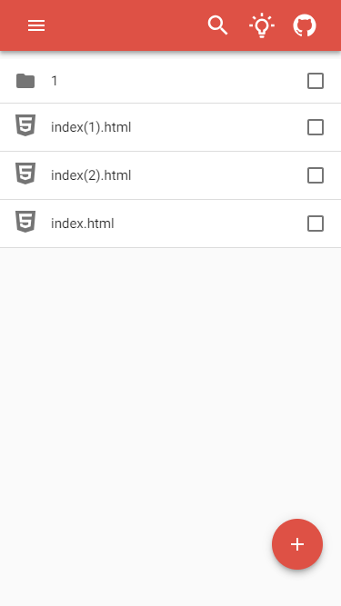
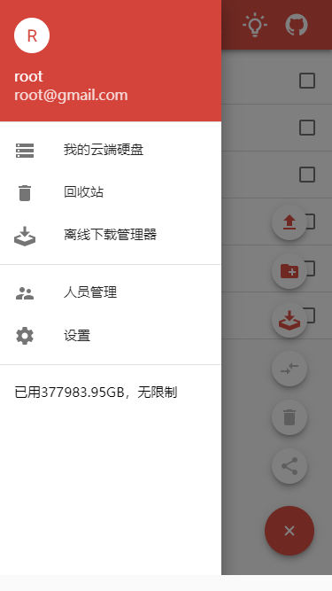
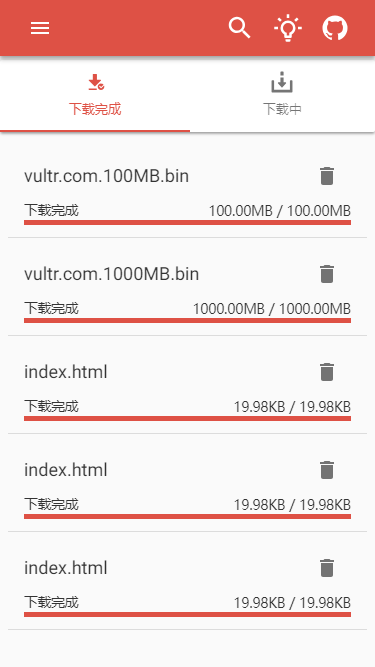
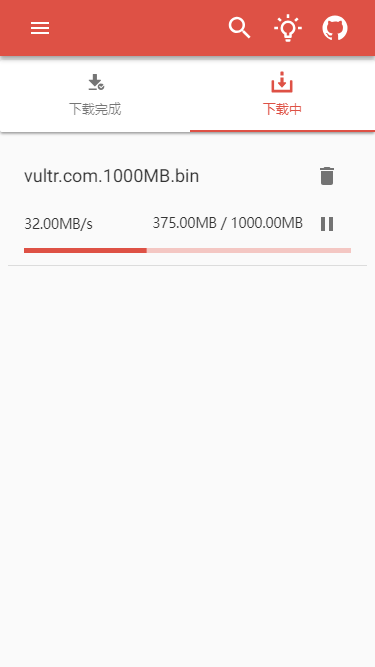

    
    

        
A simple cloud project

    

    

         
         
         
         
    

## Contents

* [Usage](#usage)
* [Features](#features)
* [Todo](#todo)
* [License](./LICENSE)

### Usage

    1. git clone https://github.com/Mrdaigithub/cloud.git
    
    2. cd projectPath/client
       yarn install && yarn run build
    
    3. cd projectPath/api
       chmod -x -R storage && chmod -x -R bootstrap
       php artisan passport:client --password   // we will get a secret
       vim projectPath/api/.env  // according to actual condition write config
    
    4. cd projectPath/laradock
       docker-compose up -d caddy postgres redis aria2

### Features

- [x] 添加aria2离线下载功能
- [x] 添加下载链接分享功能
- [x] 添加android客户端 (Android至下载功能, 未完成)
- [x] 添加资源预览
- [x] 添加在线观看视频
- [x] 实现登陆，注销功能
- [x] 实现用户上传下载文件功能
- [x] 实现多用户管理功能

### Todo
